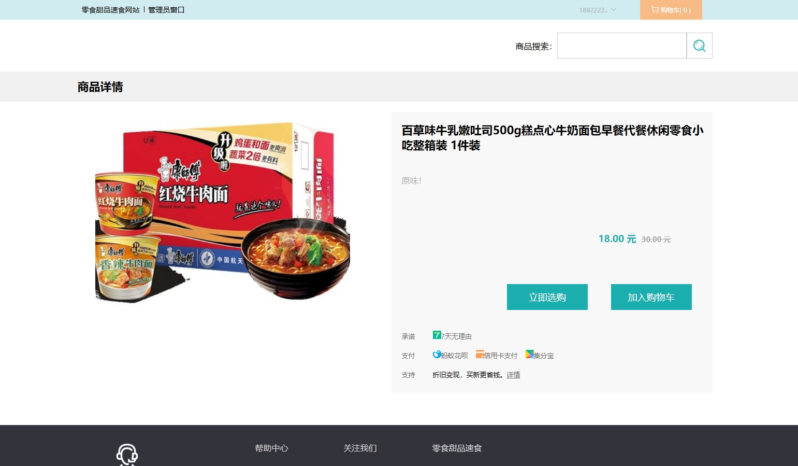
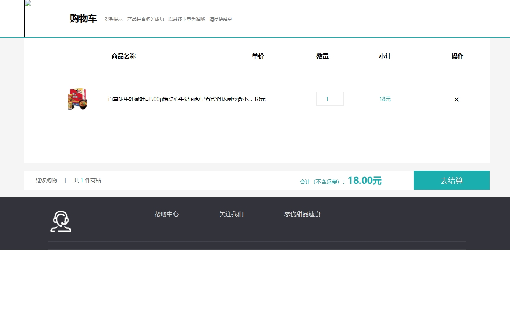
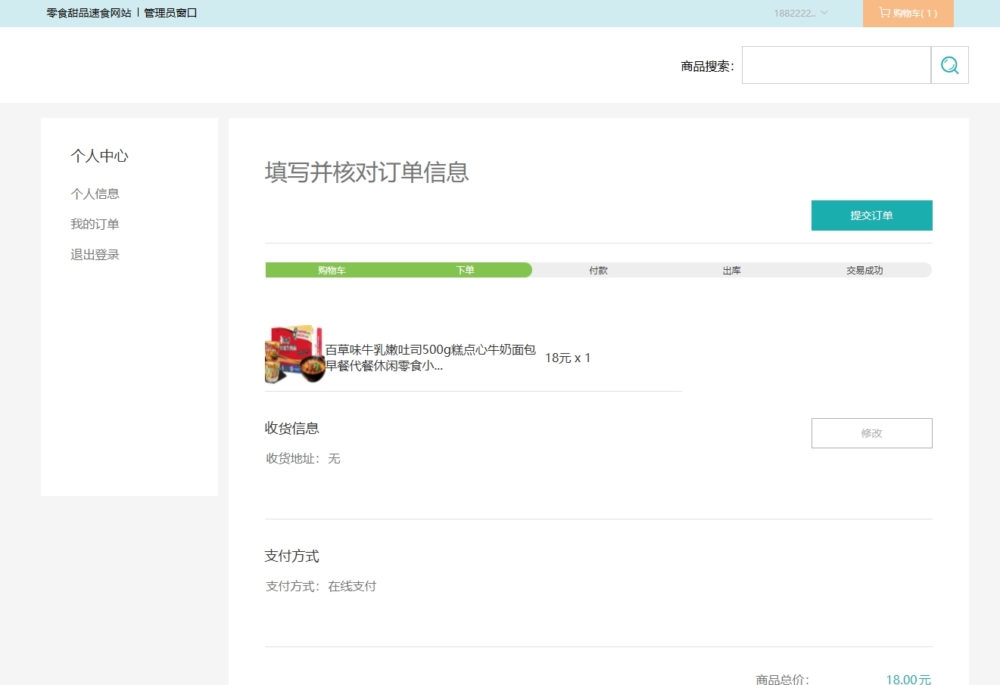
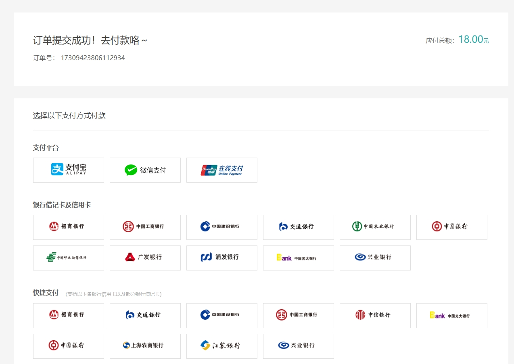
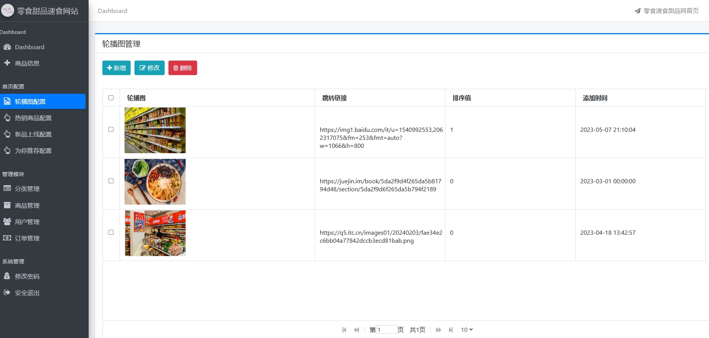
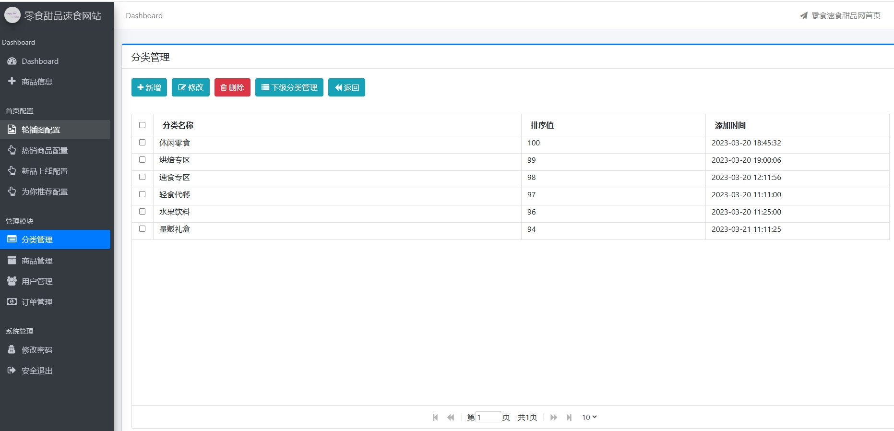
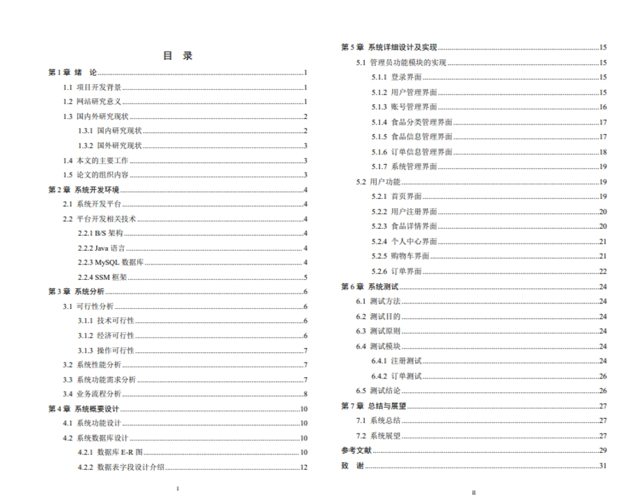

# 1.项目介绍
- 功能模块：管理端（用户管理、账号管理、商品分类管理、商品信息管理、订单管理等），用户端（商品信息、登录注册、我的订单等）
- 技术栈：SpringBoot，thymeleaf，MyBatis等
- 测试环境：jdk1.8，idea2024，maven3，navicat，mysql5.7
# 2.项目部署
- 创建数据库，导入sql文件
- idea打开项目，根据本地数据库环境配置src/main/resources/application.properties  9-12行，非常重要
- 启动项目
- 门户：http://localhost:28095/  账号自行注册
- 后端管理web，http://localhost:28095/admin/login  账号密码：admin/123456
# 3.项目部分截图

# 4.获取方式
[戳我查看](https://gitee.com/aven999/mall)